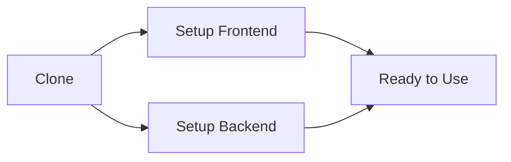
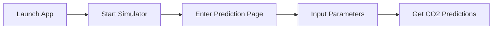

<div align="center">

# 🌍 EcoMeter
### Your Smart CO2 Prediction Companion

[](https://reactjs.org/)
[](https://www.python.org/)

-------------------

</div>

## 🚀 Quick Start Guide


### 📋 Prerequisites

> Before you begin, ensure you have the following installed:

```markdown
✅ Git
✅ Node.js & npm
✅ Python 3.x
✅ VS Code (Recommended)
```

### ⚡ One-Click Setup



### 🔥 Installation Steps

<details>
<summary>1️⃣ Clone & Navigate</summary>

```bash
# Clone the repository
git clone https://github.com/binitworld/EcoMeter.git

# Navigate to project
cd EcoMeter

# Open VS Code
code .
```
</details>

<details>
<summary>2️⃣ Frontend Setup (Terminal 1)</summary>

```bash
# Navigate to frontend
cd frontend

# Install packages
npm i

# Start frontend server
npm start
```
> 🌐 Access at: http://localhost:3000
</details>

<details>
<summary>3️⃣ Backend Setup (Terminal 2)</summary>

```bash
# Install Python packages
pip install -r requirements.txt

# Launch backend server
python main.py
```
</details>

## 🎮 Usage Flow



## ⚠️ Important Notes

> 🔔 Key Points to Remember

* Keep both terminals active
* Frontend & backend must run simultaneously
* Monitor console for logs
* Follow error messages if any

## 🎯 Quick Tips

| Action | Description |
|--------|-------------|
| 🔄 Refresh | If changes don't appear |
| 💻 Console | Check for any errors |
| 🌐 API | Monitor backend responses |

<div align="center">

## 📜 License & Copyright

**© 2024 Team EcoMeter. All Rights Reserved.**

-------------------

### *Building a Greener Future with Smart Predictions* 🌱

</div>
